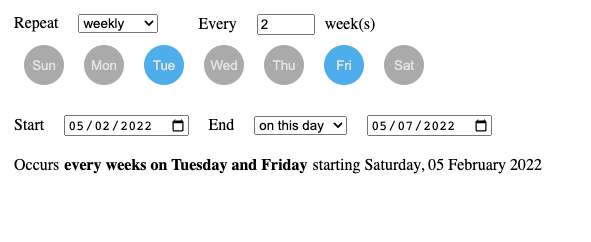
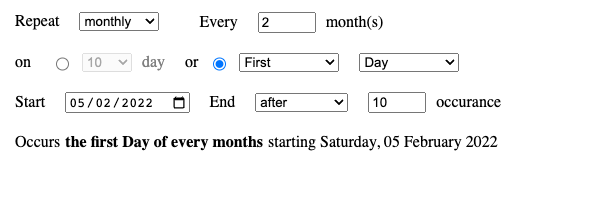

# React Recurring Job
A simple and lightweight library for scheduling recurring events in React.

## Getting Started
```shell
npm install react-recurring-job
```

## Demo



## Usage

```javascript
import Recurrence from 'react-recurring-job';

function App() {
  return (
    <Recurrence
      startDate={new Date()}
      endDate={new Date(2030, 11, 31)}
      repeat="weekly"
    />
  );
}


export default App;
```

## Props

| Names  | Type           | Default | Description | Mandatory |
| ------ | -------------- |---------|-------------| --------- |
| startDate| Date/String | new Date()|The starting date of the recurring event| No |
| endDate| Date/string | null |The ending date of the recurring event | No |
| repeat| string | 'weekly' |The repeating of the reoccurring event. Possible values: __"weekly"__, __"monthly"__. | No |
| frequency| number | 1 | The interval between each recurrence. | No |
| disabled | boolean | false | Disable all fields | No |
| showFrequency | boolean | true | Show frequency selection box | No |
| selectedEndType | string | 'noend' | The end type of the recurring event. Possible values: __"noend"__, __"date"__, __"count"__ | No |
| endCount | number | 10 | The end count of the recurring event | No |
| cronExpression | string | '' | Cron Expression of the recurring event to set the fied values for editing  | No |
| showCronExpression | boolean | false | Show cron expression of recurring event at the bottom | No |
| onChange | function |  | Have single object argument, which contains user selected settings  | No |


## CSS 

| Rule name  | Description | 
| ------ | -------------- |
| root | styles applied to root element |

## License
React Recurring Job is open-sourced software licensed under the MIT license.


